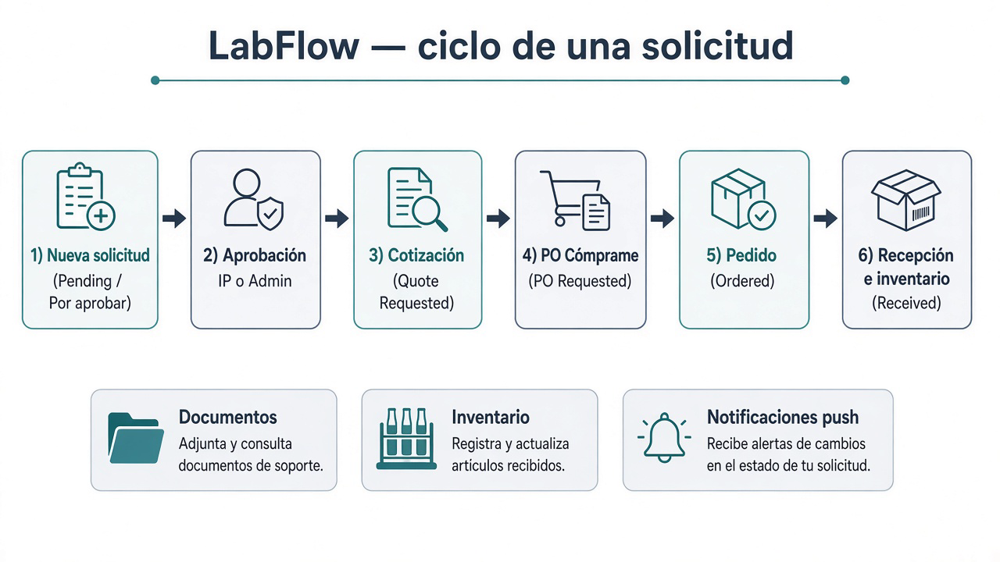
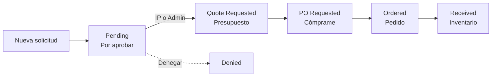
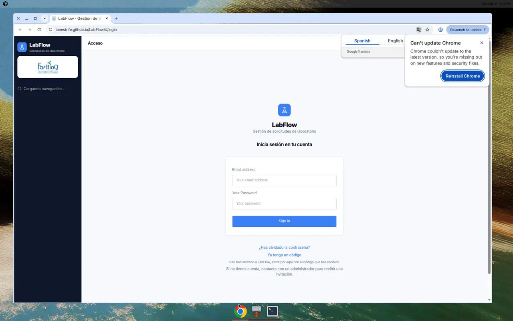
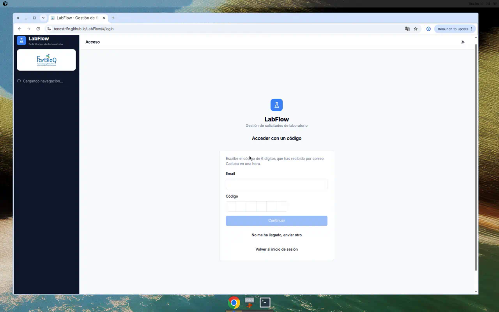

# LabFlow

Gestión de **solicitudes de laboratorio** para FarBioQ (Farmacología y Bioquímica de Enfermedades Inmunomediadas, UGR).

Cubre el ciclo completo de compra: alta → aprobación → cotización → PO («Cómprame») → pedido → recepción → inventario, documentos y gastos. Sedes: **CIBM** y **Farmacia**.

**App en producción:** [https://tonestrife.github.io/LabFlow/](https://tonestrife.github.io/LabFlow/)

---

## Cómo funciona (rápido)

<p align="center">
  
</p>



| Quién | Qué hace |
| --- | --- |
| **Solicitante** | Crea solicitudes, recibe pedidos, consulta inventario/documentos |
| **IP del proyecto** | Aprueba o deniega solicitudes `Pending` de sus proyectos |
| **Gerente de cuenta** | Como solicitante + gestionar inventario |
| **Admin** | Todo: usuarios, permisos, proyectos, direcciones, forzar estados, gastos… |

Tutorial completo (pantallas, roles, menús, notificaciones): **[docs/COMO-FUNCIONA.md](docs/COMO-FUNCIONA.md)**

---

## Acceso

<p align="center">
  
</p>

1. Entra con email y contraseña.
2. Si te han **invitado**, pulsa **Ya tengo un código**, escribe el email y el código de **6 dígitos** del correo (caduca en ~1 h) y elige contraseña.
3. Si olvidaste la contraseña, usa **¿Has olvidado la contraseña?** (también con código OTP).

<p align="center">
  
</p>

---

## Mapa de la app

| Sección | Para qué sirve |
| --- | --- |
| **Panel de Control** | Solicitudes por fase (por aprobar, presupuestos, PO, por recibir…) |
| **Nueva solicitud** | Botón de la cabecera (no está en el menú lateral) |
| **Proveedores** | Catálogo de vendors |
| **Inventario** | Stock; se puede reordenar desde aquí |
| **Documentos** | Cotizaciones, PO, albaranes, facturas |
| **Gastos** | Registro y gráficos de gasto |
| **Admin** | Usuarios, proyectos, direcciones, plantillas email, notificaciones, permisos |
| **Perfil** | Datos, sede, preferencias push/email |

El selector de **sede** (CIBM / Farmacia / Todas) filtra listados según la dirección de envío.

---

## Stack

- React + Vite + TypeScript + Tailwind / shadcn
- Supabase (Auth, Postgres, Storage, Edge Functions)
- Firebase Cloud Messaging (push)
- Deploy: GitHub Pages (`/LabFlow/`, rutas con hash `#/...`)

---

## Desarrollo local

```bash
npm install
npm run dev          # http://localhost:8080
```

Necesitas variables `VITE_*` (Supabase, y opcionalmente Firebase / Gemini) en un `.env` local.

```bash
npm run build
npm run deploy       # gh-pages → dist
```

Migraciones SQL: `supabase/migrations/`.  
Edge function de push: `supabase functions deploy send-notification`.

---

## Docs

- [Cómo funciona LabFlow](docs/COMO-FUNCIONA.md) — guía de usuario visual
