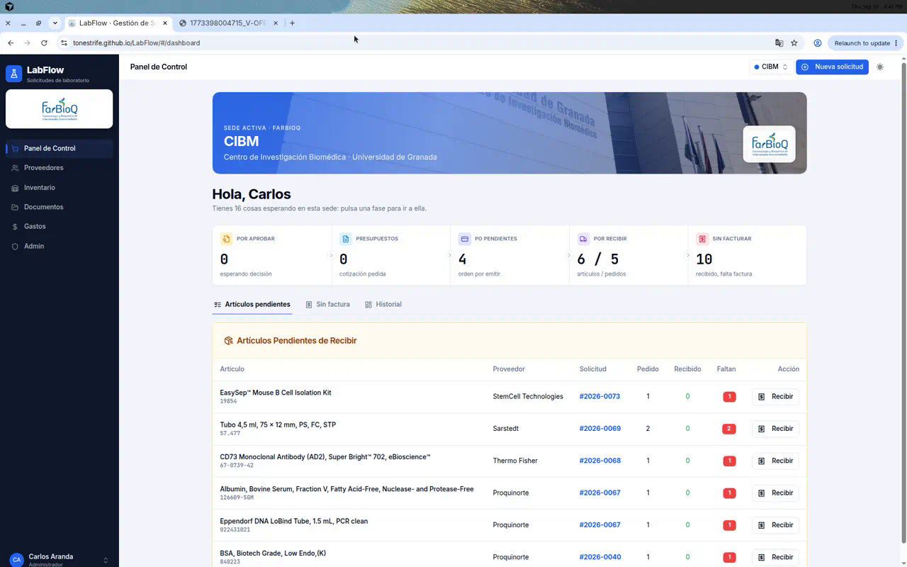
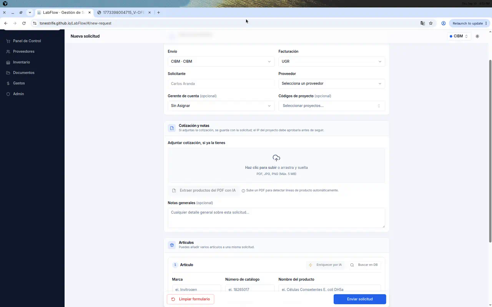
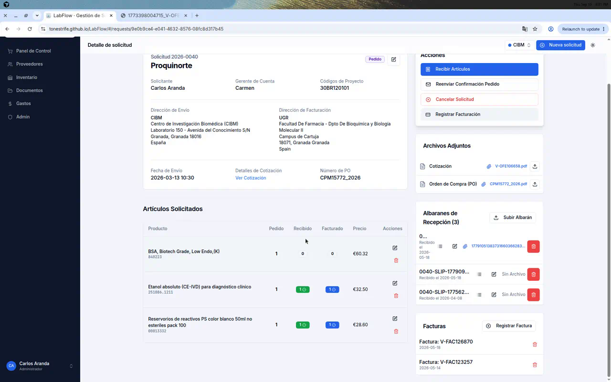
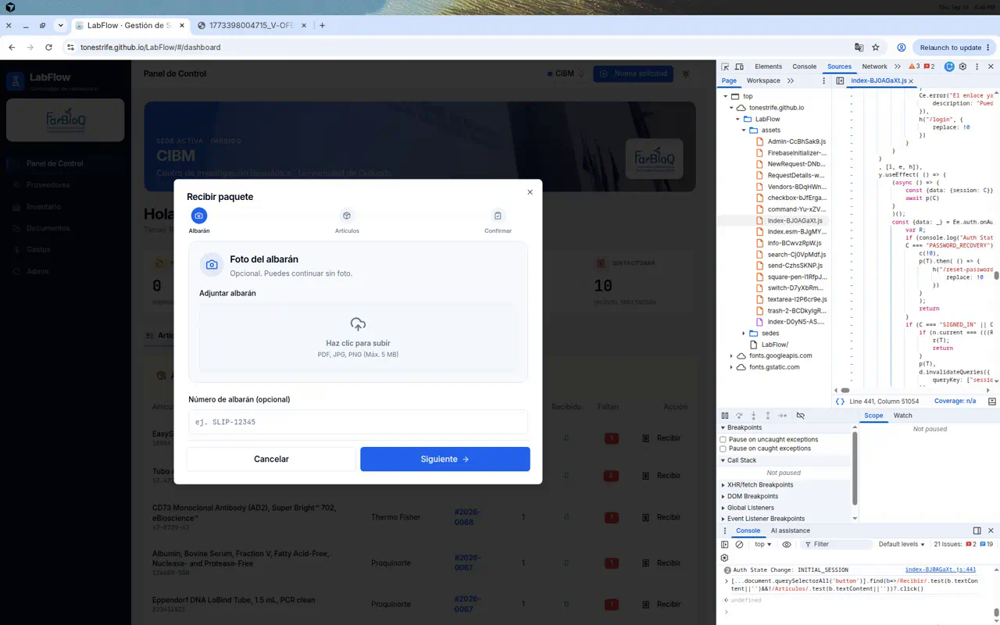
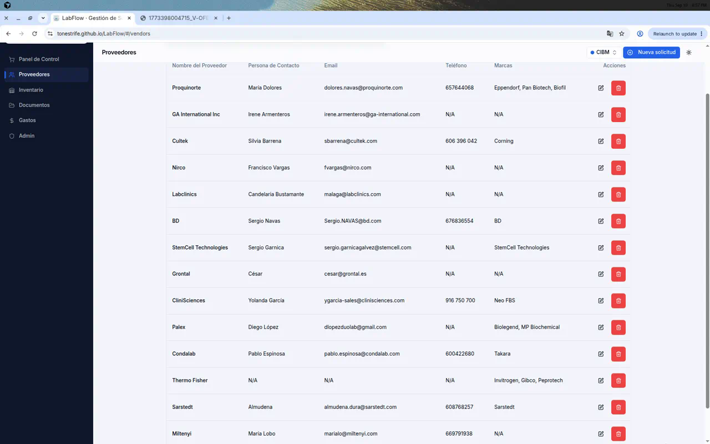
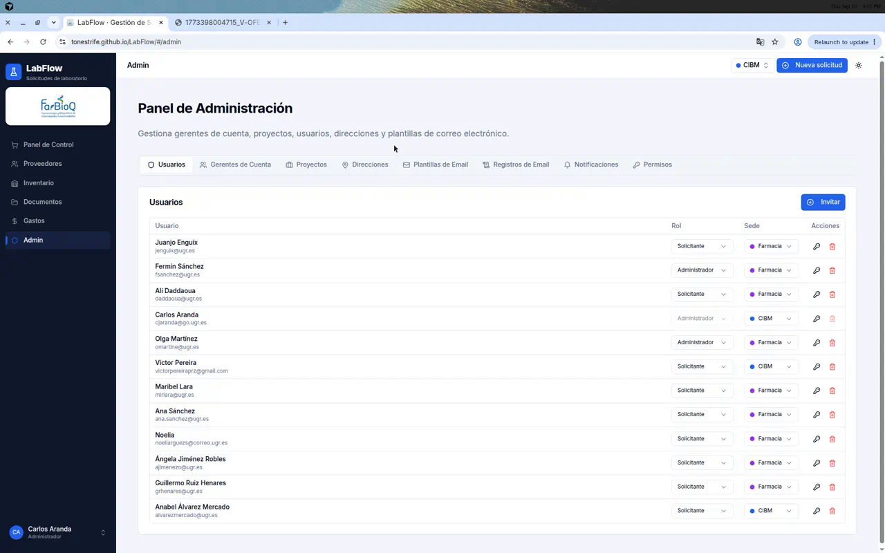
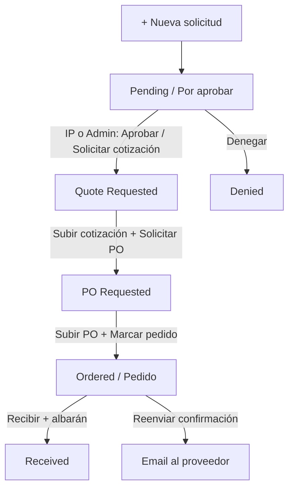

# Cómo funciona LabFlow

Guía visual del flujo de compra (con tu cuenta de Admin).  
App: [https://tonestrife.github.io/LabFlow/](https://tonestrife.github.io/LabFlow/)

Hay un mini-vídeo resumen (slideshow de pantallas reales):  
[`tutorial_flujo_labflow_carlos.mp4`](assets/tutorial_flujo_labflow_carlos.mp4) — también en los artefactos del agente.

---

## 1. Panel de Control

Aquí empieza casi todo:

- **Tarjetas de fase**: Por aprobar → Presupuestos → PO pendientes → Por recibir → Sin facturar  
- **Sede activa** (CIBM / Farmacia / Todas) filtra lo que ves  
- **+ Nueva solicitud** (cabecera)  
- Tabla **Artículos pendientes** con botón **Recibir** por fila  

---

## 2. Nueva solicitud

Formulario: proveedor, proyecto(s), dirección, líneas de producto y adjuntos.  
Al guardar entra en **Pending** (*Por aprobar*). Si subes cotización al crear, **sigue Pending** hasta que apruebe el IP o un Admin.

---

## 3. Detalle de solicitud (el corazón del flujo)

### Dónde se suben las cosas

| Qué | Dónde en la ficha |
| --- | --- |
| **Cotización** | Panel derecho → *Archivos adjuntos* → **Cotización** (icono subir / “Ver cotización”) |
| **Orden de compra (PO)** | Mismo panel → **Orden de compra** |
| **Albaranes** | *Albaranes de recepción* → **Subir albarán** (o el asistente Recibir) |
| **Facturas** | *Facturas* → **Registrar factura** |

### Cómo se edita

- Lápiz junto al título / datos generales de la solicitud  
- Lápiz en cada línea de artículo  
- Botones de estado en **Acciones** (derecha), según el estado actual  

### Correos automáticos

En **Acciones** verás botones del tipo:

- Solicitar cotización / aprobar y pedir cotización  
- Solicitar PO («Cómprame»)  
- **Reenviar confirmación de pedido**  

Abren el diálogo de email con plantilla rellenada (destinatario del proveedor o gerente). Puedes revisar y enviar.

Las plantillas se editan en **Admin → Plantillas de Email**.

---

## 4. Recepción con albarán

Desde el panel (**Recibir**) o desde la ficha (**Recibir artículos**):

Asistente en 3 pasos:

1. **Albarán** — foto/PDF + número (opcional)  
2. **Artículos** — cantidades recibidas (parcial OK)  
3. **Confirmar**  

Eso actualiza stock y el estado hacia **Received** cuando está completo.

---

## 5. Proveedores

Menú **Proveedores**:

- **+** / nuevo proveedor  
- Icono **lápiz** en cada fila → editar nombre, contacto, email, teléfono, marcas  
- Icono papelera → borrar (con cuidado)

El email del proveedor es el que usan los correos automáticos de cotización/pedido.

---

## 6. Admin y correos

En **Admin**:

| Pestaña | Para qué |
| --- | --- |
| Usuarios | Invitar, rol, sede |
| Gerentes / Proyectos / Direcciones | Maestros del flujo |
| **Plantillas de Email** | Textos de cotización, PO, confirmación… |
| Registros de Email | Histórico de envíos |
| Notificaciones | Prueba push FCM |
| Permisos | Quién puede aprobar, recibir, etc. |

---

## 7. Ciclo completo (botones típicos)

Inventario, Documentos y Gastos existen en el menú, pero el día a día del laboratorio es: **Panel → solicitud → cotización/PO → recepción**.

---

## Notas rápidas

- Rutas con hash: `#/dashboard`, `#/requests/<id>`, `#/vendors`, `#/admin`  
- La sede de la dirección de envío controla el filtro del panel  
- Push: un dispositivo activo por usuario; si ves dobles, reabre la PWA tras actualizar  
