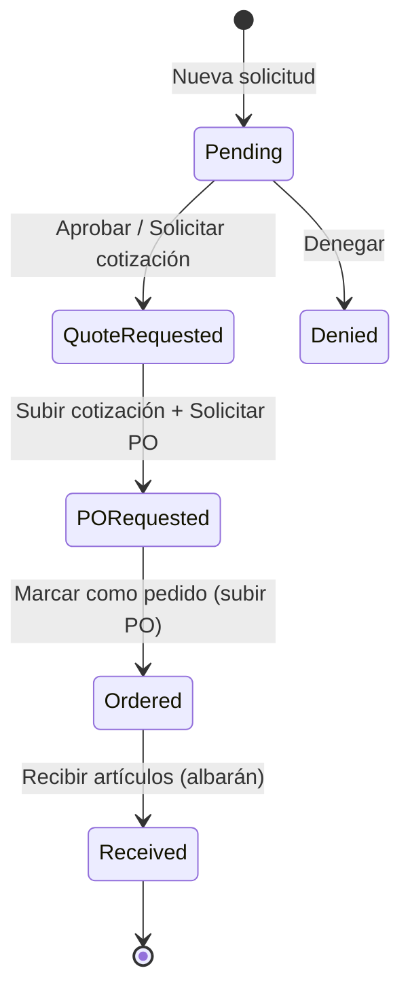

# Cómo funciona LabFlow

Guía visual para el equipo FarBioQ. La app en producción está en  
[https://tonestrife.github.io/LabFlow/](https://tonestrife.github.io/LabFlow/).

---

## 1. Entrar

| Situación | Qué hacer |
| --- | --- |
| Ya tienes cuenta | Email + contraseña → **Iniciar sesión** |
| Te han invitado | **Ya tengo un código** → email + código de 6 dígitos del correo → elige contraseña |
| Olvidaste la contraseña | **¿Has olvidado la contraseña?** → te llega un código OTP |

> El código caduca en aproximadamente **una hora**. Si no llega, pide otro desde la misma pantalla.

---

## 2. Qué ves al entrar

Menú lateral (según permisos):

1. **Panel de Control** — hub de solicitudes  
2. **Proveedores**  
3. **Inventario**  
4. **Documentos**  
5. **Gastos**  
6. **Admin** (solo quien gestiona usuarios)

En la **cabecera**:

- Selector de **sede**: CIBM / Farmacia / Todas  
- Botón **Nueva solicitud** (siempre a mano; no está en el menú)  
- Acceso a **Perfil** y cerrar sesión (bloque de usuario del lateral)

---

## 3. Ciclo de una solicitud

### Paso a paso

1. **Nueva solicitud**  
   Productos (opcional ayuda con IA), proyecto(s), proveedor, direcciones de envío/facturación.  
   Estado inicial: **Pending** (*Por aprobar*).  
   Si adjuntas cotización al crear, **sigue Pending** hasta que apruebe el IP o un admin.

2. **Aprobación** (IP del proyecto o Admin)  
   - Solicitar cotización por correo  
   - Aprobar solamente / Aprobar y solicitar cotización  
   - Denegar  

3. **Presupuesto** (`Quote Requested`)  
   Subir cotización del proveedor → **Solicitar PO (Cómprame)**.

4. **PO** (`PO Requested`)  
   Subir la orden de compra → **Marcar como Pedido**.

5. **Recepción** (`Ordered` → `Received`)  
   Registrar albarán y cantidades (puede ser parcial). Los artículos pasan al **inventario**.

En el panel, las fases se ven como: **Por aprobar**, **Presupuestos**, **PO pendientes**, **Por recibir**, **Sin facturar** (esta última, Admin).

---

## 4. Roles (resumen)

| Rol | Etiqueta | Capacidad típica |
| --- | --- | --- |
| `Requester` | Solicitante | Crear y seguir solicitudes; recibir; ver inventario/docs |
| `Account Manager` | Gerente de cuenta | Lo anterior + gestionar inventario |
| `Admin` | Administrador | Configuración completa + forzar estados |
| **IP** | Investigador principal *(del proyecto)* | Aprobar/denegar `Pending` de sus proyectos aunque su rol sea Solicitante |

Los permisos finos (crear, aprobar, documentos, gastos…) se ajustan en **Admin → Permisos**.  
El **Owner** de LabFlow tiene todos los permisos y no se le pueden quitar.

---

## 5. Otras piezas

### Inventario
Stock alimentado al recibir pedidos. Con permiso de gestión puedes editar y **reordenar** (abre una nueva solicitud).

### Documentos
Centraliza cotizaciones, órdenes de compra, albaranes y facturas. Filtra por tipo, proveedor, solicitante o fechas.

### Gastos
Registro e importación ligados a proyectos / proveedores / solicitudes recibidas, con gráficos.

### Admin
Usuarios e invitaciones, gerentes, **proyectos** (con IP), direcciones (con sede), plantillas de email, prueba de notificaciones push, matriz de permisos.

### Notificaciones
En **Perfil** puedes:

- Activar push en este dispositivo  
- Avisos de nuevas solicitudes  
- Avisos de cambio de estado (eligiendo qué estados)

---

## 6. Sedes

LabFlow distingue **CIBM** y **Farmacia**.

- El filtro de cabecera limita listados a la sede de la **dirección de envío**.  
- Tu sede por defecto la asigna un Admin en el perfil (solo lectura para ti).  
- Direcciones sin sede no entran bien en el filtro: un Admin debería completarlas.

---

## 7. Consejos rápidos

- La acción del día a día suele empezar en **Panel de Control** o en **Nueva solicitud**.  
- Si una solicitud “no se puede aprobar”, suele faltar ser **IP del proyecto** o Admin.  
- En móvil (PWA), activa las notificaciones desde Perfil; si ves avisos dobles, reabre la app para actualizar el service worker.  
- Las rutas usan hash (`#/dashboard`, `#/login`, …) porque la app vive en GitHub Pages bajo `/LabFlow/`.

---

## Para desarrollo

Ver el [README principal](../README.md): `npm run dev`, variables `VITE_*`, migraciones Supabase y deploy de edge functions.
